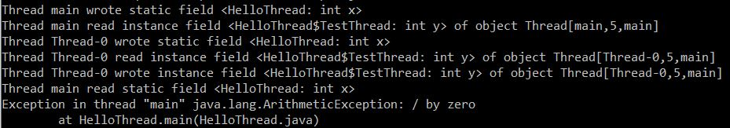

# Soot-Application
Assignment 2 for course CS7301

The steps followed in this assignment are present here: https://o2lab.github.io/710/p/a1.html

**Part 0: Installation and setup**

I have used Eclipse Kepler and soot-3.3.0

The steps to install are specified in the link.

Files:

a)	TestSoot.java
b)	HelloThread.java

**Part 1: Control Flow Analysis - Finding Denominators**

Follow along and perform the steps to get an understanding of Soot

Files:

a)	TestDominatorFinder.java
b)	DominatorFinder.java
c)	GCD.java

**Part 2: Data Flow Analysis - Call Graph Construction**

This is also a follow along part to introduce Call Graph Construction and orient us with two main types of call graph construction algorithms: Class Hierarchy Analysis (CHA) and Point-to-analysis (PTA)

Files:

  a)	Example.java
  b)	TestSootCallGraph.java

**Part 3: Program Instrumentation with Soot**

In this part, we add Jimple code in Java code to profile the program execution. This process is called instrumentation.

1. Logging Method Calls

This is a follow along to understand logging of method calls. Follow the steps mentioned on their page as it is important for the next step.

 Files:

    a)	Example.java
    b)	TestSootLogging.java

1. Tracing Heap Access

 In this part, we will apply the logging technique learnt in previous section.

 Files:

    a)	Log.java
    b)	HelloThread.java
    c)	TestSootLoggingHeap.java

There are two tasks to accomplish:

   a) Instrument HelloThread.java to find:

      - Variable is static or not
      - Variable is read or being written to
      - Object name

You can find the code starting from line number 71 in TestSootLoggingHeap.java under the comment &quot;part 2 working&quot;

 After executing the code, the output will look like this
 

Note: ArithmeticException is due to the race condition

   b) Instrument HelloThread.java to find:

      - Variable is static or not
      - Variable is read or being written to
      - Object name
      - Value of the object

This part is not completed. Pull requests are welcome!
